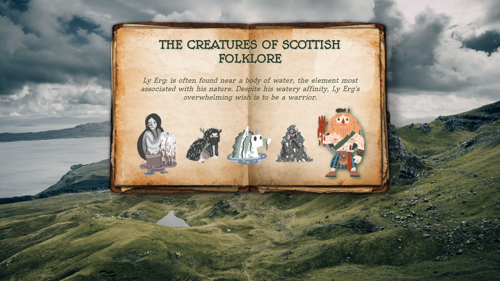
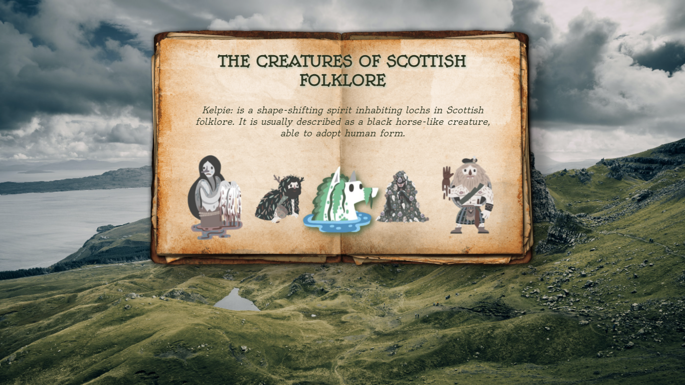

# Scottish Mythical Beasts

### General Info:

This is a very simple React project.

The main concept was to present random facts about each beast, whenenever the mouse pointer is moved onto an element (in this case - the image).

My personal objective here was to get familiarized with React functionality, and present the user with some unknown aspects of Scottish folklore in a more interactive way. 

### Technologies:
* React
* JavaScript
* HTML
* CSS

### Technologies (Others):
* Google Fonts - Fonts

### Preview:

I           |  II
:-------------------------:|:-------------------------:
   |    

### References:
* Monster images sourced from "Mythical Beasts of Scotland" project by [Púca Printhouse](https://www.pucaprinthouse.com/)
* The background picture taken from [unsplash](unsplash.com)
* The book .png taken from [pngwing](https://www.pngwing.com/)